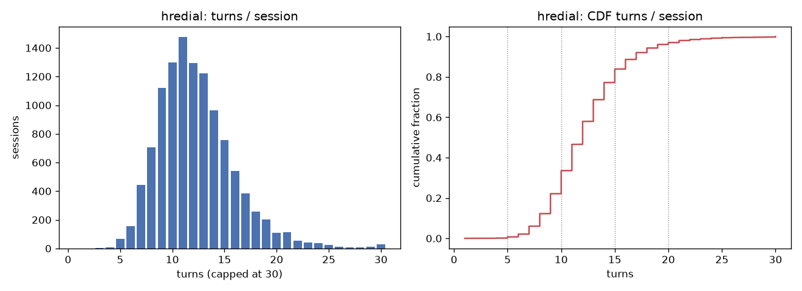
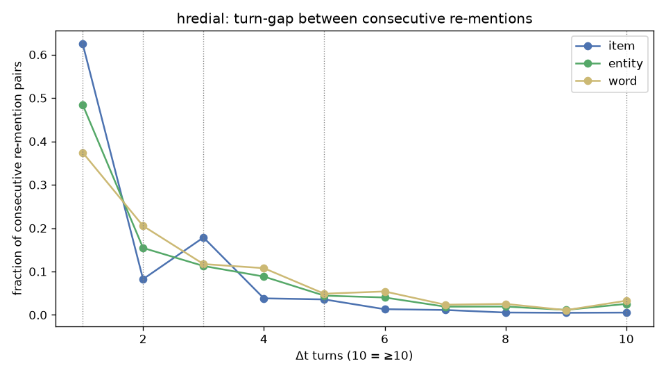
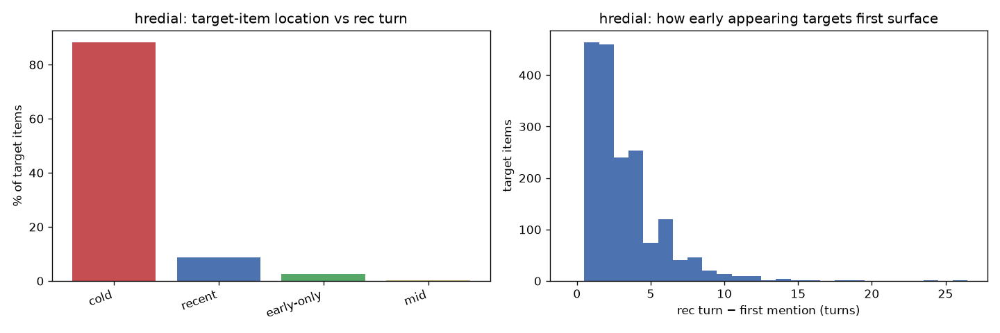
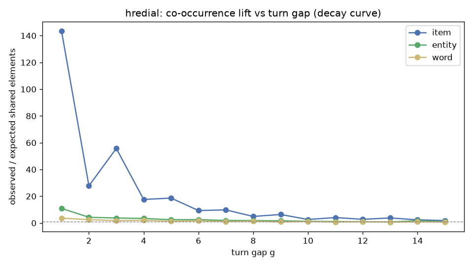
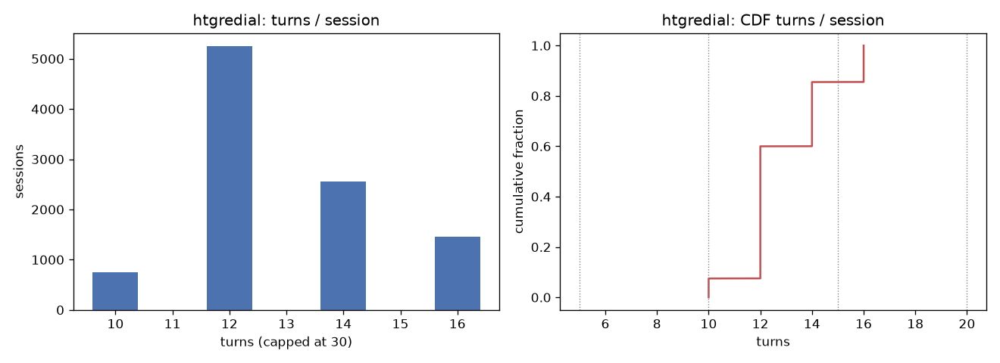
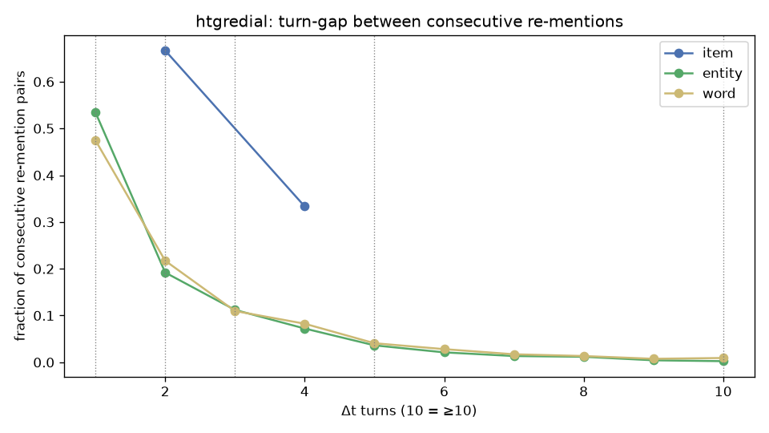
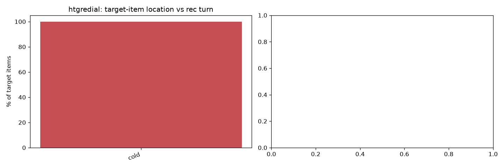
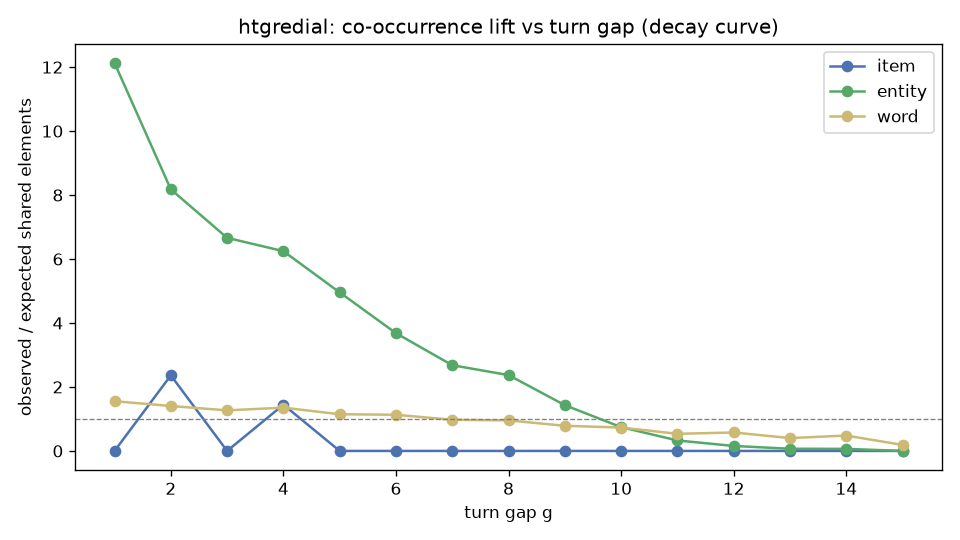

# Sliding-window hyperedge — dataset statistics

Generated by `analysis/window_stats.py`. Sessions = unique conversations (train+valid+test pooled, deduped by `conv_id`). A *turn* = consecutive same-role utterances merged (as in `HReDialDataset._convert_to_id`).

## hredial — EN (ReDial)  (11,348 sessions)

### Stat 1 — turns / session

| metric | turns/session | utterances/session |
| --- | --- | --- |
| mean | 12.3 | 18.16 |
| median | 12.0 | 17.0 |
| std | 3.79 | 5.28 |
| p25 | 10.0 | 15.0 |
| p75 | 14.0 | 21.0 |
| p90 | 17.0 | 25.0 |
| p95 | 19.0 | 28.0 |
| min | 1.0 | 1.0 |
| max | 83.0 | 116.0 |

| ≥5 turns | ≥10 | ≥15 | ≥20 |
| --- | --- | --- | --- |
| 99.87 % | 77.89 % | 22.81 % | 3.94 % |

| bucket | sessions | share |
| --- | --- | --- |
| short(<5) | 15 | 0.1 % |
| medium(5-10) | 3792 | 33.4 % |
| long(>10) | 7541 | 66.5 % |

### Stat 2 — turn-gap between consecutive re-mentions (drives w)

| kind | #pairs | median Δt | Δt≤1 | Δt≤2 | Δt≤3 | Δt≤5 | Δt≤10 |
| --- | --- | --- | --- | --- | --- | --- | --- |
| item | 12317 | 1.0 | 62.5 % | 70.74 % | 88.58 % | 95.97 % | 99.59 % |
| entity | 4256 | 2.0 | 48.47 % | 63.91 % | 75.19 % | 88.46 % | 98.33 % |
| word | 66022 | 2.0 | 37.43 % | 57.95 % | 69.66 % | 85.32 % | 97.99 % |

### Stat 3 — ground-truth item position vs recommend turn

11,347 sessions with an identifiable recommend turn; 15,095 target items (13,331 cold / 1,764 appear before the rec turn).

Rec turn sits 3 turns from the session end (mean 3.3, p90 6).

| target-item category | share of ALL targets | share of APPEARING targets |
| --- | --- | --- |
| cold (never before rec turn) | 88.31 % | — |
| recent (last mention <=3 before) | 8.71 % | 74.55 % |
| early-only (single early mention, not repeated) | 2.6 % | 22.28 % |
| mid (repeated but last mention far) | 0.37 % | 3.17 % |

Distance in turns (targets that appear before the rec turn):

| metric | rec − first mention | rec − last mention |
| --- | --- | --- |
| mean | 3.19 | 2.76 |
| median | 2.0 | 2.0 |
| p90 | 6.0 | 6.0 |
| max | 26.0 | 24.0 |

> cold = target introduced by the recommender, absent from prior session context (neither local window nor session-global history contains it -> needs KG / collaborative channel). Among targets that DO appear before the rec turn, 'early-only' is the population that motivates H_global; 'recent' is where a local window already suffices.

### Stat 4 — empirical decay curve (co-occurrence lift vs gap)

| kind | g=1 | g=2 | g=3 | g=5 | g=10 | g=15 |
| --- | --- | --- | --- | --- | --- | --- |
| item | 143.46 | 27.79 | 55.73 | 18.63 | 2.62 | 1.84 |
| entity | 10.89 | 4.3 | 3.72 | 2.46 | 1.33 | 0.94 |
| word | 3.64 | 2.5 | 1.82 | 1.29 | 1.13 | 0.69 |

### Stat 5 — hyperedge collapse risk (w ≥ |session|)

| w | overall collapse | short(<5) | medium(5-10) | long(>10) |
| --- | --- | --- | --- | --- |
| 1 | 0.01 % | 6.67 % | 0.0 % | 0.0 % |
| 2 | 0.02 % | 13.33 % | 0.0 % | 0.0 % |
| 3 | 0.05 % | 40.0 % | 0.0 % | 0.0 % |
| 5 | 0.71 % | 100.0 % | 1.74 % | 0.0 % |
| 10 | 33.55 % | 100.0 % | 100.0 % | 0.0 % |

> collapse = w >= |session|  ->  local hyperedge == global hyperedge

## htgredial — ZH (TG-ReDial)  (10,000 sessions)

### Stat 1 — turns / session

| metric | turns/session | utterances/session |
| --- | --- | --- |
| mean | 12.94 | 12.94 |
| median | 12.0 | 12.0 |
| std | 1.66 | 1.66 |
| p25 | 12.0 | 12.0 |
| p75 | 14.0 | 14.0 |
| p90 | 16.0 | 16.0 |
| p95 | 16.0 | 16.0 |
| min | 10.0 | 10.0 |
| max | 16.0 | 16.0 |

| ≥5 turns | ≥10 | ≥15 | ≥20 |
| --- | --- | --- | --- |
| 100.0 % | 100.0 % | 14.5 % | 0.0 % |

| bucket | sessions | share |
| --- | --- | --- |
| short(<5) | 0 | 0.0 % |
| medium(5-10) | 749 | 7.5 % |
| long(>10) | 9251 | 92.5 % |

### Stat 2 — turn-gap between consecutive re-mentions (drives w)

| kind | #pairs | median Δt | Δt≤1 | Δt≤2 | Δt≤3 | Δt≤5 | Δt≤10 |
| --- | --- | --- | --- | --- | --- | --- | --- |
| item | 3 | 2.0 | 0.0 % | 66.67 % | 66.67 % | 100.0 % | 100.0 % |
| entity | 28741 | 1.0 | 53.46 % | 72.66 % | 83.87 % | 94.71 % | 99.93 % |
| word | 715597 | 2.0 | 47.47 % | 69.19 % | 80.16 % | 92.48 % | 99.55 % |

### Stat 3 — ground-truth item position vs recommend turn

10,000 sessions with an identifiable recommend turn; 10,000 target items (10,000 cold / 0 appear before the rec turn).

Rec turn sits 1 turns from the session end (mean 1.0, p90 1).

| target-item category | share of ALL targets | share of APPEARING targets |
| --- | --- | --- |
| cold (never before rec turn) | 100.0 % | — |

> cold = target introduced by the recommender, absent from prior session context (neither local window nor session-global history contains it -> needs KG / collaborative channel). Among targets that DO appear before the rec turn, 'early-only' is the population that motivates H_global; 'recent' is where a local window already suffices.

### Stat 4 — empirical decay curve (co-occurrence lift vs gap)

| kind | g=1 | g=2 | g=3 | g=5 | g=10 | g=15 |
| --- | --- | --- | --- | --- | --- | --- |
| item | 0.0 | 2.36 | 0.0 | 0.0 | 0.0 | 0.0 |
| entity | 12.13 | 8.18 | 6.66 | 4.96 | 0.74 | 0.0 |
| word | 1.55 | 1.4 | 1.27 | 1.15 | 0.73 | 0.19 |

### Stat 5 — hyperedge collapse risk (w ≥ |session|)

| w | overall collapse | short(<5) | medium(5-10) | long(>10) |
| --- | --- | --- | --- | --- |
| 1 | 0.0 % | n/a | 0.0 % | 0.0 % |
| 2 | 0.0 % | n/a | 0.0 % | 0.0 % |
| 3 | 0.0 % | n/a | 0.0 % | 0.0 % |
| 5 | 0.0 % | n/a | 0.0 % | 0.0 % |
| 10 | 7.49 % | n/a | 100.0 % | 0.0 % |

> collapse = w >= |session|  ->  local hyperedge == global hyperedge
